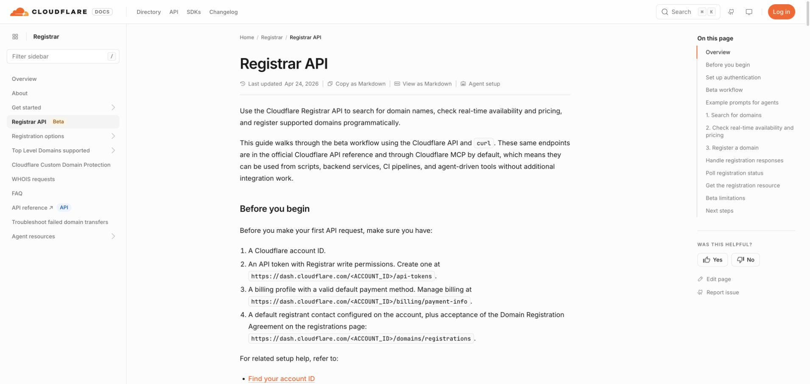

# Cloudflare Registrar API setup

**English** · [简体中文](setup.zh-CN.md)

Cloudflare Registrar availability checks require an account ID and an API
token. The Registrar API is currently limited to supported extensions.

## 1. Prepare the account

Open the Cloudflare dashboard and copy the target account ID. The official
[Registrar API guide](https://developers.cloudflare.com/registrar/registrar-api/)
also requires a billing profile, default payment method, registrant contact,
and accepted registration agreement.

## 2. Create an API token

Open **My Profile → API Tokens → Create Token** and grant the Registrar API
permissions described in the official guide. Add both values to `.env`:

```dotenv
CLOUDFLARE_ACCOUNT_ID=your_account_id
CLOUDFLARE_API_TOKEN=your_api_token
```

Never commit the token or account-specific screenshots.

## 3. Verify the setup

Return to `/letsfinddomain-skill` and ask:

```text
Check example.com and show its availability and renewal price.
```

The result should be `taken`. Unsupported extensions are reported as
unsupported, not available.


