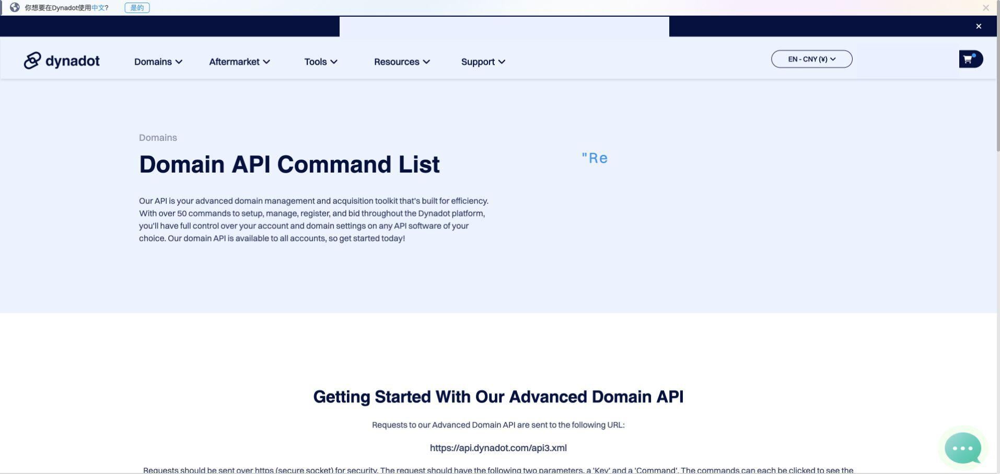

# Dynadot API 配置

[English](setup.md) · **简体中文**

Dynadot 普通 Regular 账号默认是单线程、约每秒一个请求。本 skill 默认采用这个保守频率。

## 1. 打开 API 设置

注册或登录 [Dynadot](https://www.dynadot.com/?7F7B7B8j9N9A8a7z)，打开 **Account Control Panel → Tools → API**。

## 2. 创建或复制 API Key

启用 API 访问并创建或复制 API Key，写入 `.env`：

```dotenv
DYNADOT_API_KEY=你的_api_key
```

如果你的账号是 Bulk 或 Super Bulk，请先确认对应的官方限流规则，再调整 `DOMAIN_FINDER_DYNADOT_LIMIT`。

## 3. 验证配置

回到 `/letsfinddomain-skill`，输入：

```text
检查 example.com，并告诉我可用性和续费价格。
```

如果需要使用 Dynadot 的精确注册价和续费价，可额外设置：

```dotenv
DOMAIN_FINDER_PRICE_SOURCE=dynadot
```


