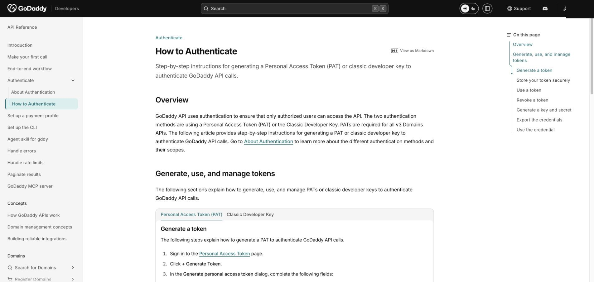

# GoDaddy API 配置

[English](setup.md) · **简体中文**

本 skill 使用 GoDaddy 只读的域名可用性 API 和批量查询接口。

## 1. 打开开发者门户

登录 [GoDaddy Developer Portal](https://developer.godaddy.com/)，然后打开
[How to Authenticate](https://developer.godaddy.com/en/docs/api-users/auth/how-to)。

## 2. 创建 Personal Access Token

创建 PAT，并只授予 `domains.domain:read` 权限。复制 Token 后写入 `.env`：

```dotenv
GODADDY_PAT=你的_personal_access_token
```

本 skill 只需要读取权限，不会注册域名或修改域名。

## 3. 验证配置

回到 `/letsfinddomain-skill`，输入：

```text
检查 example.com，并告诉我可用性和续费价格。
```

结果应显示 `taken`。GoDaddy 返回的限流响应头会由查询程序自动处理。


