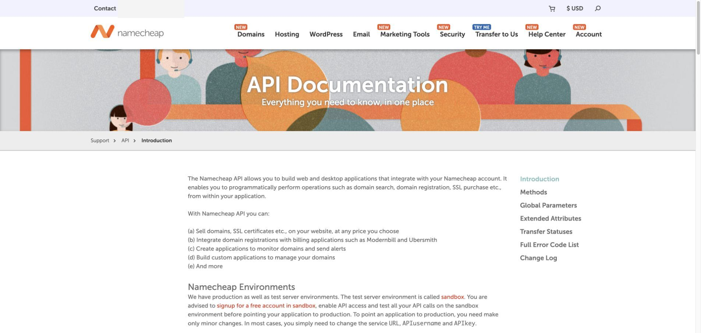

# Namecheap API 配置

[English](setup.md) · **简体中文**

Namecheap 需要先开通生产环境 API，并把运行 skill 的机器公网 IPv4 加入白名单。API 返回 XML，查询程序会自动解析。

## 1. 打开 API Access

登录 [Namecheap](https://www.namecheap.com/)，打开 **Profile → Tools → Business & Dev Tools → Manage API Access**。也可以先使用 Sandbox 测试集成。

## 2. 开通访问并加入 IPv4 白名单

启用 API 访问、接受条款，并添加运行 skill 的机器公网 IPv4。把以下配置写入 `.env`：

```dotenv
NAMECHEAP_API_USER=你的_api_user
NAMECHEAP_USERNAME=你的_username
NAMECHEAP_API_KEY=你的_api_key
NAMECHEAP_CLIENT_IP=你的公网_ipv4
```

`username` 和 `API user` 通常相同，但建议分别填写两个变量。

## 3. 验证配置

回到 `/letsfinddomain-skill`，输入：

```text
检查 example.com，并告诉我可用性和续费价格。
```

结果应显示 `taken`。


