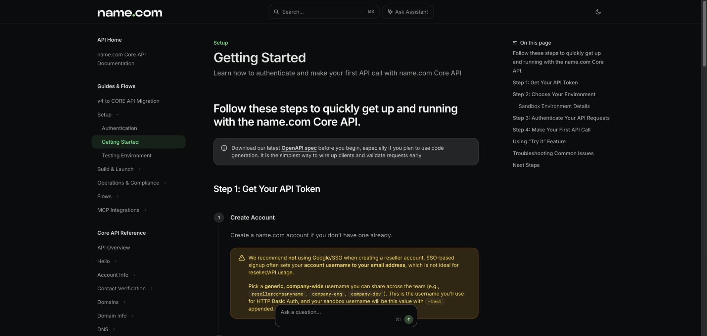

# Name.com API 配置

[English](setup.md) · **简体中文**

Name.com Core API 一次可在可用性请求中查询最多 50 个域名。

## 1. 打开 API Token 设置

登录 [Name.com](https://www.name.com/)，打开
[Account Settings → API Tokens](https://www.name.com/account/settings/api)。

## 2. 创建生产环境 Token

为生产环境账号创建 API Token，将用户名和 Token 一起设置为系统环境变量，具体见[跨平台配置](../../../references/environment.md#system-environment-variables)：

```dotenv
NAMECOM_USERNAME=你的_username
NAMECOM_API_TOKEN=你的_api_token
```

只有在明确需要 Sandbox 查询时，才使用 Sandbox 凭据。

## 3. 验证配置

回到 `/letsfinddomain-skill`，输入：

```text
检查 example.com，并告诉我可用性和续费价格。
```

`example.com` 应显示为 `taken`。


