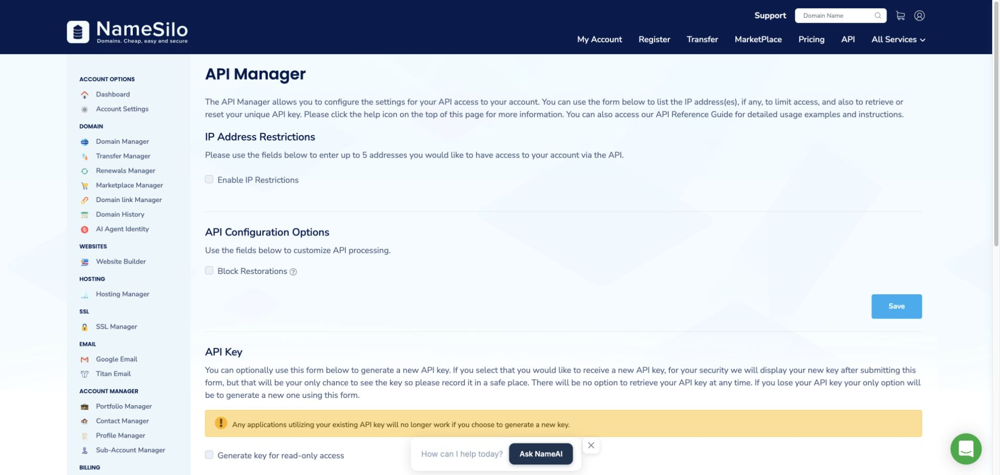

# NameSilo API 配置

[English](setup.md) · **简体中文**

NameSilo 支持批量查询。自动化批量请求必须使用 `/apibatch` 接口，查询程序已经自动处理。

## 1. 打开 API Manager

注册或登录 [NameSilo](https://www.namesilo.com/?rid=2f35224vs)，打开
[Account → API Manager](https://www.namesilo.com/account/api-manager)。

## 2. 生成 API Key

生成 API Key，并按需配置 IP 限制。NameSilo 只会在生成时显示新 Key，请立即安全保存，然后写入 `.env`：

```dotenv
NAMESILO_API_KEY=你的_key
```

不要把 Key 放进命令、README、截图或 Git 提交。

## 3. 验证配置

回到 `/letsfinddomain-skill`，输入：

```text
检查 example.com，并告诉我可用性和续费价格。
```

查询程序应返回 `taken`。


