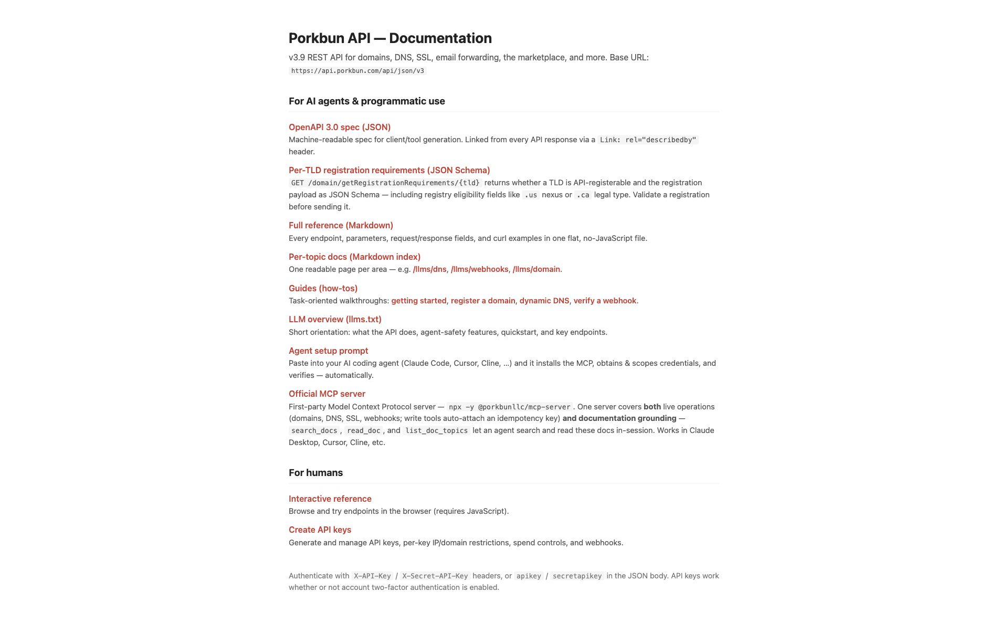

# Porkbun API setup

**English** · [简体中文](setup.zh-CN.md)

Porkbun has two useful paths: its public TLD price list needs no credentials,
while account-based availability checks require an API key and secret.

## 1. Open API Access

Sign in to [Porkbun](https://porkbun.com/account), then open
[Account → API Access](https://porkbun.com/account/api).

## 2. Create an API key pair

Create a new API key and secret. Copy the secret immediately and, if needed,
restrict the key by IP address or domain. Add both values to the skill's `.env`:

```dotenv
PORKBUN_API_KEY=your_api_key
PORKBUN_SECRET_API_KEY=your_secret_api_key
```

The checker uses the read-only domain availability endpoint. Porkbun's public
price list remains available without a key and is the default reference price
source.

## 3. Verify the setup

Return to `/letsfinddomain-skill` and ask:

```text
Check example.com and show its availability and renewal price.
```

`example.com` should be reported as `taken`. Porkbun availability checks are
one domain per request, so large candidate lists are automatically paced by the
skill.


