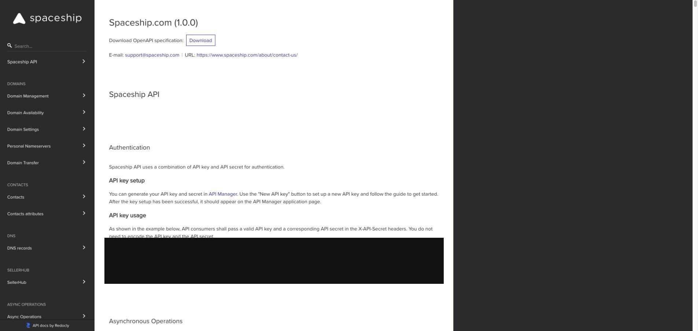

# Spaceship API setup

**English** · [简体中文](setup.zh-CN.md)

Default availability provider because its endpoint accepts up to 20 domains in
one request.

## 1. Open API Manager

Sign in to [Spaceship](https://www.spaceship.com/), then open
[API Manager](https://www.spaceship.com/application/api-manager/).

## 2. Create credentials

Create a new API key and secret. Keep both values private; the secret may only
be shown once. Put them in the repository `.env` file:

```dotenv
SPACESHIP_API_KEY=your_key
SPACESHIP_API_SECRET=your_secret
```

The checker only uses the domain availability read operation.

## 3. Verify the setup

Return to `/letsfinddomain-skill` and ask:

```text
Check example.com and show its availability and renewal price.
```

`example.com` should be reported as `taken`.


